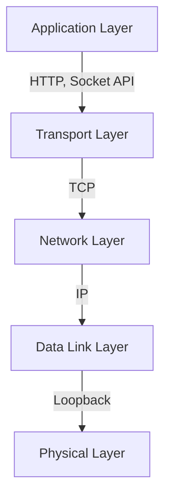

## Introduction

Network communication forms the backbone of modern distributed systems, yet its inner workings often remain a black box to many developers. This article demystifies the journey of a network packet as it travels through the TCP/IP stack on a local machine. By examining the communication between a client and server on localhost, we'll uncover the intricate dance of protocols, system calls, and kernel operations that make network communication possible.

Through practical experiments and real-time packet analysis, we'll trace how data moves from a user application through various network layers, exploring why certain architectural decisions were made in the TCP/IP protocol suite and how they affect performance. This understanding is crucial for debugging network issues, optimizing application performance, and building robust distributed systems.

The source code for all experiments discussed in this article is available in my [trace-packet repository](https://github.com/subaru-hello/trace-packet).

## System Environment

```bash
# System Information
Darwin wajis-Air 23.1.0 Darwin Kernel Version 23.1.0
x86_64 architecture
```

## Socket Communication Fundamentals

Socket communication serves as the foundation of network programming, providing a standardized interface between applications and the network stack. When an application creates a socket, the operating system establishes a bidirectional communication channel that abstracts the complexities of network protocols. This abstraction allows developers to treat network communication similarly to file operations, using familiar read and write operations.

### Socket Architecture Evolution

The development of socket types reflects the evolution of operating system architecture and network programming needs. Internet sockets emerged from the Berkeley Software Distribution (BSD) in the early 1980s as part of the nascent TCP/IP protocol suite. UNIX domain sockets, introduced later, addressed the need for efficient inter-process communication on single machines.

**Internet Sockets** were designed for network communication across different machines. They implement the TCP/IP protocol stack, handling tasks such as packet fragmentation, routing, and delivery confirmation. This robustness comes at the cost of additional overhead, as each packet must traverse the entire network stack.

**UNIX Domain Sockets**, in contrast, optimize for local communication. When processes on the same machine need to communicate, UNIX domain sockets bypass network protocol processing entirely. Instead, they perform direct memory transfers between processes, resulting in significantly better performance for local inter-process communication.

## Communication Flow Analysis

The journey of data through the network stack involves multiple layers, each serving a specific purpose in ensuring reliable communication. Let's examine this process in detail:

### Application Layer Interaction

The communication process begins in the application layer, where programs interact with sockets through system calls. Here's how a typical client-server interaction unfolds:

```c
// Client side
int sockfd = socket(AF_INET, SOCK_STREAM, 0);
connect(sockfd, (struct sockaddr *)&serv_addr, sizeof(serv_addr));
send(sockfd, buffer, strlen(buffer), 0);

// Server side
int server_fd = socket(AF_INET, SOCK_STREAM, 0);
bind(server_fd, (struct sockaddr *)&address, sizeof(address));
listen(server_fd, 3);
new_socket = accept(server_fd, (struct sockaddr *)&address, &addrlen);
```

### Kernel Space Processing

When data enters kernel space, the TCP/IP stack performs several critical operations. The three-way handshake establishes a reliable connection between client and server, ensuring both sides are ready to communicate. The kernel manages connection states through dedicated queue structures: the SYN queue holds incomplete connections during the handshake process, while the Accept queue maintains fully established connections waiting for application acceptance.

### Network Interface Layer Operations

At the lowest level of the network stack, we can observe the actual transmission of packets. Using tcpdump, we can capture and analyze this traffic:

```bash
$ sudo tcpdump -i any port 8080
tcpdump: data link type PKTAP
tcpdump: listening on any, link-type PKTAP
```

## Performance Analysis of Local Communication

Local network communication exhibits unique characteristics that distinguish it from regular network traffic. When a packet is destined for localhost (127.0.0.1), it follows a specialized path through the network stack:

The routing process for localhost traffic is remarkably efficient:
```bash
traceroute to 127.0.0.1 (127.0.0.1), 64 hops max
1  localhost (127.0.0.1)  0.288 ms
```

Active connections can be monitored using netstat:
```bash
$ netstat -an | grep ESTABLISHED
tcp4  0  0  127.0.0.1.8080  127.0.0.1.50234  ESTABLISHED
```

### Performance Characteristics

Local communication benefits from several optimizations in modern operating systems. The loopback interface bypasses physical network hardware entirely, operating purely in software. This results in sub-millisecond latencies and minimal resource overhead. MacOS further optimizes this process through specialized packet processing paths for localhost traffic.

## Network Protocol Stack Visualization



## Practical Implications and Best Practices

Understanding localhost communication has significant implications for system design and debugging. The high performance and reliability of local communication make it ideal for microservices architectures where services need to communicate frequently. However, developers should be aware that this performance profile doesn't extend to network communication across physical interfaces.

The debugging toolset for network issues becomes more effective when you understand the underlying system. Tcpdump reveals actual packet flow, helping identify protocol-level issues. Netstat provides visibility into connection states, crucial for debugging connection problems. Traceroute, while simple for localhost, becomes valuable when troubleshooting network paths in distributed systems.

## Conclusion

This deep dive into TCP/IP communication reveals the sophisticated engineering that enables reliable network communication. By understanding how packets flow through the various layers of the network stack, developers can make better architectural decisions and more effectively debug network-related issues. The optimizations present in localhost communication demonstrate the continued evolution of operating systems to provide efficient solutions for local inter-process communication.

## References
- [trace-packet](https://github.com/subaru-hello/trace-packet)
- [Web Server Architecture Evolution 2023](https://blog.ojisan.io/server-architecture-2023/)
- [TCP/IP Illustrated, Volume 1: The Protocols](https://amzn.asia/d/4JALXBW)