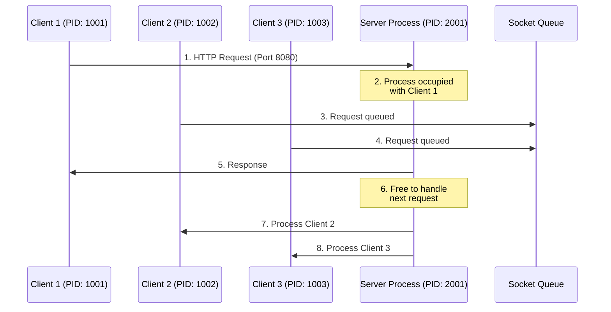
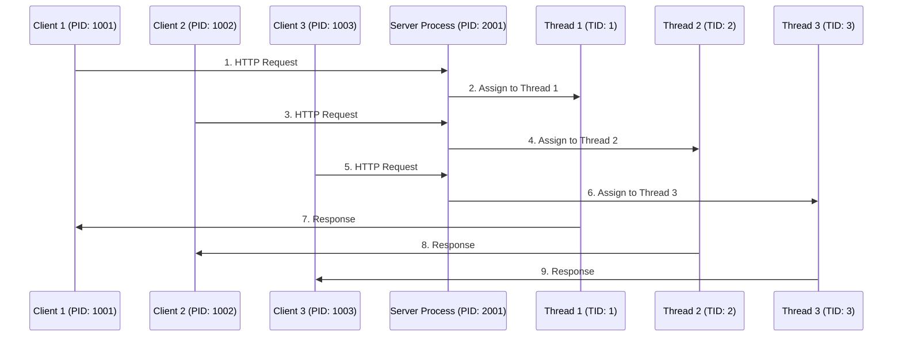
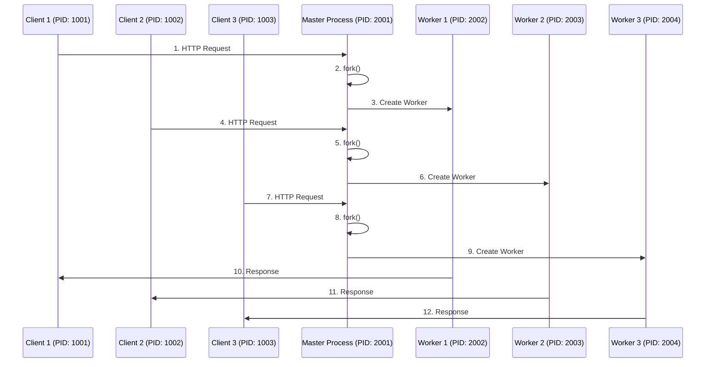
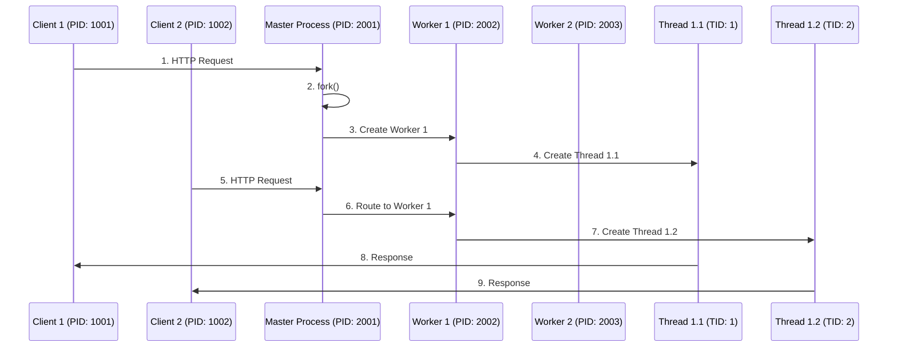
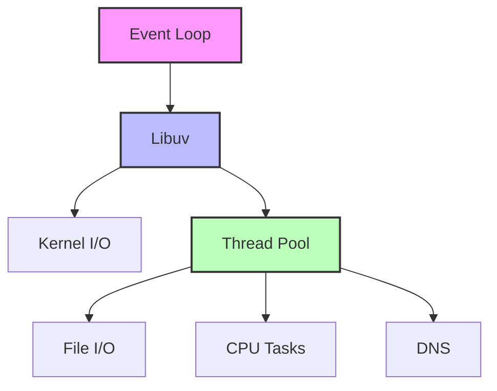
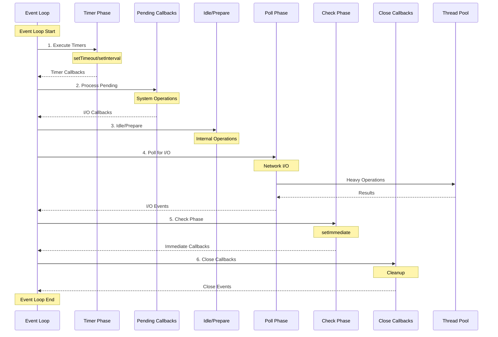

## Introduction

Understanding the differences between processes and threads is crucial in system design. In this article, we'll implement and explore four different communication patterns, examining their characteristics and historical evolution.

The source code for this project can be found [here](https://github.com/subaru-hello/multi-process-thread).

## System Environment

```bash
$ uname -a
# System Information
Darwin wajis-Air 23.1.0 Darwin Kernel Version 23.1.0
x86_64 Architecture
```

## Architecture Comparison

Let's examine each architecture pattern in detail, following the request flow and system behavior:

### 1. Single Process/Single Thread


**Flow Description:**
1. Client 1 initiates an HTTP request to the server process on port 8080
2. The single server process (PID: 2001) handles Client 1's request exclusively
3. Client 2's request arrives but must wait in the socket queue
4. Client 3's request also joins the queue
5. Server completes processing Client 1's request and sends response
6. Server process becomes available for the next request
7. Server begins processing Client 2's queued request
8. Finally, server handles Client 3's request

**Key Characteristics:**
- Location: All processing occurs in a single process space
- Trigger: Incoming HTTP requests on port 8080
- Queue: System socket queue (managed by OS)
- Process ID: Single server process (PID: 2001)

### 2. Single Process/Multi Thread


**Flow Description:**
1. Client 1 sends request to main server process
2. Server spawns/assigns Thread 1 (TID: 1) to handle Client 1
3. Client 2's request arrives at server
4. Server assigns Thread 2 (TID: 2) for Client 2
5. Client 3 connects to server
6. Server delegates to Thread 3 (TID: 3)
7-9. Each thread processes and responds independently

**Key Characteristics:**
- Location: Single process space with multiple threads
- Trigger: Thread assignment by main server process
- Memory: Shared memory space between threads
- Process/Thread IDs: One PID (2001) with multiple TIDs (1,2,3)

### 3. Multi Process/Single Thread


**Flow Description:**
1. Client 1 connects to master process
2-3. Master process forks to create Worker 1 (PID: 2002)
4-6. Second client triggers creation of Worker 2 (PID: 2003)
7-9. Third client connection spawns Worker 3 (PID: 2004)
10-12. Each worker process handles its client independently

**Key Characteristics:**
- Location: Separate process spaces
- Trigger: fork() system call on new connections
- IPC: Required for inter-process communication
- Process IDs: Unique PID for each worker (2002-2004)

**Historical Context and Evolution:**
The Multi Process/Single Thread model emerged in the early 2000s as a response to both the C10K problem and the increasing availability of multi-core processors. Nginx, released in 2004, popularized this approach by implementing an event-driven architecture with worker processes. This model was particularly influential in Unix-like systems, where the `fork()` system call provided an efficient way to create new processes.

**Technical Innovations:**
The success of this model led to several key innovations in system architecture:
1. The pre-fork worker pattern, where a pool of worker processes is created at startup
2. Zero-copy networking techniques to minimize data transfer overhead
3. Process-based isolation for enhanced security and reliability

Chrome browser's adoption of this model in 2008 marked another significant milestone, using separate processes for each tab to prevent a single webpage from affecting the entire browser's stability. This approach demonstrated the model's effectiveness in desktop applications, not just server environments.

### 4. Multi Process/Multi Thread


**Flow Description:**
1. Client 1 initiates connection to master process
2-3. Master process creates Worker 1 through fork()
4. Worker 1 spawns Thread 1.1 for Client 1
5. Client 2 connects to master process
6. Master routes request to existing Worker 1
7. Worker 1 creates Thread 1.2 for Client 2
8-9. Threads process and respond to their respective clients

**Key Characteristics:**
- Location: Multiple process spaces, each with multiple threads
- Trigger: Connection routing and thread creation
- Memory: Isolated process memory with shared thread memory within each process
- IDs: Multiple PIDs (2001-2003) each with multiple TIDs

**Historical Context and Evolution:**
The Multi Process/Multi Thread architecture represents the culmination of concurrent programming evolution, emerging in the mid-2000s. Apache HTTP Server 2.x was one of the first major applications to implement this hybrid approach, combining the stability of process isolation with the efficiency of thread-based concurrency.

**Technological Drivers:**
Several factors contributed to the adoption of this sophisticated model:
1. The rise of large-scale web applications requiring both reliability and performance
2. Advancement in operating system capabilities for process and thread management
3. Development of sophisticated monitoring and debugging tools
4. Increased demand for flexible resource utilization in cloud environments

Modern implementations of this pattern often feature dynamic scaling capabilities:
```go
// Modern Go implementation example
type Server struct {
    NumProcesses int
    ThreadsPerProcess int
}

func (s *Server) Start() {
    for i := 0; i < s.NumProcesses; i++ {
        process := NewWorkerProcess()
        for j := 0; j < s.ThreadsPerProcess; j++ {
            process.SpawnThread(func() {
                // Thread worker logic
                HandleConnections()
            })
        }
    }
}
```

**Industry Impact:**
This model became particularly relevant with the advent of cloud computing and containerization:
- Amazon's AWS Lambda initially used this pattern for optimal resource utilization
- Modern application servers like WildFly (formerly JBoss) leverage this architecture
- Container orchestration platforms like Kubernetes benefit from this model's flexibility

## Historical Background and Architecture Evolution

### 1. Single Process/Single Thread Model

This model has existed since the early days of network programming and represents the most basic architecture.

**Historical Context and Technologies:**
The Single Process/Single Thread model emerged in the early 1990s as the foundation of network programming. Apache 1.x, released in 1995, adopted this architecture as its primary processing model, setting a standard for web servers of that era. Traditional CGI-based web applications followed this pattern because of its simplicity and straightforward debugging capabilities. Early FTP and SMTP servers also implemented this model due to the relatively low concurrent connection requirements of that time.

**Technical Limitations and Evolution:**
As the internet grew rapidly in the late 1990s, this model faced significant challenges. The most notable was the C10K problem, where servers struggled to handle more than 10,000 concurrent connections. This limitation arose because each connection required dedicated system resources, and the blocking I/O operations forced the server to wait for I/O completion before handling other requests. Furthermore, the emergence of multi-core processors exposed another weakness: the single-threaded nature of this model couldn't effectively utilize the available processing power across multiple CPU cores.

### 2. Single Process/Multi Thread Model

**Historical Context and Evolution:**
The Single Process/Multi Thread model gained prominence in the late 1990s as a response to the limitations of the single-threaded approach. This architectural shift was particularly driven by the rise of Java-based application servers, which leveraged the Java Virtual Machine's built-in thread management capabilities. The model's adoption coincided with the increasing availability of multi-core processors, allowing for better resource utilization.

**Performance Characteristics:**
In I/O-intensive applications, this model demonstrates superior performance compared to the single-threaded approach. The shared memory space among threads enables efficient communication and resource sharing, leading to reduced memory overhead. However, this advantage comes with increased complexity in thread synchronization. Developers must carefully manage access to shared resources to prevent race conditions and deadlocks, which can lead to subtle bugs and system instability.

## Understanding Process and Thread Behavior

### Memory Space and Address Space Fundamentals

#### Virtual Memory and Address Space

The operating system provides each process with its own virtual address space. This virtual address space creates an abstraction layer between the process's memory access and the physical memory, enabling:

1. **Memory Isolation**: Each process operates within its own protected address space
2. **Memory Mapping**: Virtual addresses are mapped to physical memory through the Memory Management Unit (MMU)
3. **Memory Optimization**: Only actively used memory pages need to be in physical memory

```
Virtual Address Space (Per Process)
+--------------------------------+ 0xFFFFFFFF (32-bit) or
|         Kernel Space          | 0xFFFFFFFFFFFFFFFF (64-bit)
+--------------------------------+ 
|         Stack Growth ↓        |
|             ...              |
|         Heap Growth ↑        |
|       Memory Mapped Files    |
|            BSS              |
|            Data             |
|            Text             |
+--------------------------------+ 0x00000000
```

**Key Components:**
- The MMU translates virtual addresses to physical addresses
- Page tables maintain the mapping between virtual and physical memory
- The Translation Lookaside Buffer (TLB) caches recent address translations

#### Memory Space Verification Commands

```bash
# View process memory maps for Cursor Helper process
$ pmap -x 74413
Address           Kbytes     RSS   Dirty Mode  Mapping
0000000000400000   1024      976      0 r-x-- cursor-helper
0000000000600000    128      128      0 rw--- cursor-helper
00007f4520000000  65536     1234    320 rw--- [heap]
...

# Check virtual memory statistics
$ vmstat
procs -----------memory---------- ---swap-- -----io---- -system-- ------cpu-----
 r  b   swpd   free   buff  cache   si   so    bi    bo   in   cs us sy id wa st
 2  0      0   5789   2345  15234    0    0     0     0    2    1  1  0 98  0  0

# View process memory usage for Cursor Helper
$ ps -o pid,ppid,rss,vsize,pmem,pcpu,comm -p 74413
  PID  PPID   RSS    VSIZE %MEM %CPU COMMAND
74413 74173 12324 1246050  0.1  0.0 Cursor Helper (Plugin)

# Examine process memory details
$ cat /proc/74413/status  # Note: On macOS, this command won't work as /proc is Linux-specific
Name:   Cursor Helper
State:  S (sleeping)
Pid:    74413
VmSize: 1246050 kB
VmRSS:  12324 kB
...

# Check system memory information
$ free -h
              total        used        free      shared  buff/cache   available
Mem:           16Gi        8Gi        5Gi        1Gi        3Gi        7Gi
Swap:          4Gi         0Gi        4Gi

# Additional useful commands for memory analysis
$ top -pid 74413
PID    COMMAND      %CPU TIME     #TH   #WQ  #PORT MEM    PURG   CMPRS  PGRP  PPID
74413  Cursor Help  0.0  00:26.77 12    0    142   12M    0B     0B     74173 74173
```

These commands provide insights into how memory is allocated and used by processes. Let's analyze what we see:

1. The process uses about 12MB of physical memory (RSS)
2. Virtual memory size is approximately 1.2GB (VSIZE)
3. Memory usage is relatively low at 0.1% of system memory
4. The process has multiple memory mappings including heap space
5. System has plenty of available memory and no swap usage

#### Memory Management Operations

The operating system performs several critical operations to manage memory:

1. **Page Allocation**
```c
// System call for memory allocation
void* memory = mmap(NULL, size, PROT_READ|PROT_WRITE, 
                   MAP_PRIVATE|MAP_ANONYMOUS, -1, 0);
```

2. **Page Table Management**
```c
// Page table entry structure (simplified)
struct page_table_entry {
    unsigned long physical_page_number : 52;
    unsigned int present : 1;
    unsigned int writable : 1;
    unsigned int user_accessible : 1;
    unsigned int write_through : 1;
    unsigned int cache_disabled : 1;
    unsigned int accessed : 1;
    unsigned int dirty : 1;
    unsigned int huge_page : 1;
    unsigned int global : 1;
    unsigned int unused : 3;
};
```

3. **Memory Protection**
```c
// Set memory protection
int result = mprotect(memory, size, PROT_READ|PROT_WRITE);
```

#### Address Space Layout Randomization (ASLR)

ASLR is a security feature that randomly arranges the address space positions of key data areas:

```bash
# Check ASLR status
$ cat /proc/sys/kernel/randomize_va_space
2  # Full randomization

# Disable ASLR (for debugging)
$ echo 0 | sudo tee /proc/sys/kernel/randomize_va_space

# Enable ASLR
$ echo 2 | sudo tee /proc/sys/kernel/randomize_va_space
```

**Memory Layout Impact:**
- Base addresses of executable and libraries
- Stack location
- Heap location
- Memory mapped regions

#### Memory Areas and Resource Allocation

Each process maintains its own independent memory areas:

```
+------------------------+
|       Text Area       | → Executable program code
+------------------------+
|       Data Area       | → Initialized global variables
+------------------------+
|       BSS Area       | → Uninitialized global variables
+------------------------+
|       Heap Area      | → Dynamic memory allocation
+------------------------+
|       Stack Area     | → Local variables and function calls
+------------------------+
```

**Characteristics:**
- Each process has a completely isolated memory space
- Explicit IPC (Inter-Process Communication) is required for memory sharing between processes
- Segmentation violations do not affect other processes
- Memory protection prevents access to other processes' memory

Threads within the same process share the following memory areas:

```
+------------------------+
|   Shared Memory Area   |
|   Text (Code)         | → Shared by all threads
|   Data (Global)       | → Shared by all threads
|   Heap                | → Shared by all threads
+------------------------+
|   Thread-Local Area   |
|   Stack               | → Independent per thread
|   Thread Local Storage| → Independent per thread
+------------------------+
```

**Characteristics:**
- Text, Data, and Heap areas are shared among all threads
- Each thread has its own Stack area and Thread Local Storage
- Memory sharing between threads is fast but requires synchronization
- Memory leaks can potentially affect all threads

#### Implementation Examples (Go)

```go
// Example of sharing memory between processes (using shared memory)
import "syscall"

func processMemoryExample() {
    // Create shared memory segment
    shmId, err := syscall.SysvShmGet(1234, 65536, 0666|syscall.IPC_CREAT)
    if err != nil {
        panic(err)
    }
    
    // Attach memory
    mem, err := syscall.SysvShmAttach(shmId, 0, 0)
    if err != nil {
        panic(err)
    }
}

// Example of sharing memory between threads
func threadMemoryExample() {
    // Shared variable on heap
    sharedCounter := 0
    var mutex sync.Mutex

    // Shared among multiple goroutines (threads)
    for i := 0; i < 10; i++ {
        go func() {
            mutex.Lock()
            sharedCounter++
            mutex.Unlock()
        }()
    }
}
```

#### Importance of Memory Management

1. **Process-based Isolation**
   - Security: Complete isolation of memory spaces
   - Stability: Crashes in one process don't affect others
   - Cost: Overhead in process creation and context switching

2. **Thread-based Sharing**
   - Efficiency: Fast data sharing between threads
   - Risk: Potential for race conditions and deadlocks
   - Responsibility: Proper synchronization implementation required

### 1. Process Management Commands

```bash
# Display process list
ps aux | grep server

# Example output:
# subaru 67068 0.0 0.0 33736044 1736 server  # Main server process
# subaru 67071 0.0 0.0 33730764 1664 client  # Client process
```

### 2. Context Switching

#### Process Context Switch
```c
struct task_struct *
__switch_to(struct task_struct *prev_p, struct task_struct *next_p) {
    // Save state
    save_fpu(prev);
    // Switch stack
    switch_to_extra(prev_p, next_p);
    return prev_p;
}
```

## Performance Considerations

1. **Single Process/Single Thread**
   - Simplest implementation
   - Suitable for small-scale applications
   - Limited scalability

2. **Single Process/Multi Thread**
   - Effective for I/O-intensive tasks
   - Efficient communication through shared memory
   - Care needed with synchronization complexity

## Implementation Guidelines

### 1. Pattern Selection Criteria

#### I/O-Intensive Workload Considerations

When dealing with I/O-intensive applications, the architecture should be designed to maximize throughput while minimizing resource consumption. Let's examine why single-threaded event-driven architectures often excel in this scenario:

**What are System Resources?**
System resources in the context of I/O operations include:
1. Memory
   - Stack space per thread (typically 1MB on Linux)
   - Thread control blocks
   - Thread local storage
2. CPU
   - Context switching overhead
   - Cache pollution
3. File descriptors
   - Socket handles
   - Open file handles
4. Kernel resources
   - Thread scheduling queues
   - I/O wait queues

**Resource Consumption Comparison:**

1. **Multi-Thread Model Resource Usage:**
```go
// Traditional multi-thread approach
func handleConnections(listener net.Listener) {
    for {
        conn, err := listener.Accept()
        if err != nil {
            continue
        }
        // Creates new thread for each connection
        go func(c net.Conn) {
            // Each thread consumes:
            // - 1MB stack space
            // - Thread control block
            // - Context switching overhead
            handleClient(c)
        }(conn)
    }
}
```

2. **Single-Thread Event-Driven Model:**
```go
// Event-driven approach using epoll/kqueue
func handleConnections(listener net.Listener) {
    // Single event loop
    poller := createPoller()
    
    for {
        events := poller.Wait()
        for _, event := range events {
            // Handle I/O event in the same thread
            // No additional thread resources needed
            handleEvent(event)
        }
    }
}
```

**Why Single Thread is More Efficient:**

1. **Reduced Memory Footprint**
   - Traditional approach: Memory usage grows linearly with connections
   ```
   Total Memory = Base Memory + (Stack Size × Number of Threads)
   Example: 1000 connections = 1GB+ thread stack memory
   ```
   - Event-driven approach: Nearly constant memory usage
   ```
   Total Memory = Base Memory + Event Queue Size
   Example: 1000 connections ≈ Few MB for event queue
   ```

2. **Minimized Context Switching**
   ```c
   // Cost of thread context switch
   struct thread_context {
       // CPU registers
       uint64_t rax, rbx, rcx, rdx;
       // FPU state
       struct fpu_state fpu;
       // Memory management
       struct mm_struct *mm;
       // ~700 cycles per switch
   };
   ```
   - Multi-thread: Frequent switches between threads
   - Single-thread: No thread context switches

3. **Better Cache Utilization**
   ```
   Thread 1: Cache Line A → Switch → Cache Miss
   Thread 2: Cache Line B → Switch → Cache Miss
   Thread 3: Cache Line C → Switch → Cache Miss
   
   vs.
   
   Event Loop: Cache Line A → Cache Hit → Cache Hit
   ```

4. **Efficient I/O Multiplexing**
```c
// Example of efficient I/O multiplexing (Linux)
struct epoll_event ev, events[MAX_EVENTS];
int epollfd = epoll_create1(0);

// Single thread monitors multiple file descriptors
for(;;) {
    nfds = epoll_wait(epollfd, events, MAX_EVENTS, -1);
    for(n = 0; n < nfds; ++n) {
        // Process event without thread creation
        process_event(events[n]);
    }
}
```

**Resource Consumption in Different Architectures:**

1. **Multi-Process/Multi-Thread**
   - Each process: Full memory space copy
   - Each thread: Stack allocation
   - High context switching overhead
   ```
   Resource Cost = N × Process Memory + M × Thread Stack + Context Switches
   ```

2. **Single Process/Multi-Thread**
   - Shared memory space
   - Multiple thread stacks
   - Moderate context switching
   ```
   Resource Cost = Process Memory + M × Thread Stack + Context Switches
   ```

3. **Single Process/Single Thread (Event-Driven)**
   - One memory space
   - One thread stack
   - Minimal context switching
   ```
   Resource Cost = Process Memory + Thread Stack + Event Queue
   ```

**Real-world Example: Nginx vs Apache**
```bash
# Memory usage comparison (1000 concurrent connections)
$ ps aux | grep nginx
worker: ~2MB RAM per process

$ ps aux | grep apache
worker: ~20MB RAM per process
```

This efficiency in resource usage allows event-driven single-threaded applications to handle more concurrent connections with less hardware resources, making them particularly well-suited for I/O-intensive workloads such as web servers, proxy servers, and network applications.

## Implementation Details

### Core Concepts and Motivations

#### Why Multi-Process?
Multi-process architectures provide several key advantages in modern computing environments:

1. **True Parallelism**: On multi-core systems, separate processes can run on different CPU cores simultaneously. For example, Go's runtime scheduler in versions prior to 1.5 used a single process model, but later versions adopted a multi-process approach for better CPU utilization:

```go
// Go 1.5+ example of multi-process handling
func main() {
    runtime.GOMAXPROCS(runtime.NumCPU()) // Utilize all CPU cores
    for i := 0; i < runtime.NumCPU(); i++ {
        go workerProcess()
    }
}
```

2. **Isolation and Reliability**: Process crashes don't affect other processes, making the system more resilient:
```go
// Process isolation example
if pid := syscall.Fork(); pid == 0 {
    // Child process: if it crashes, parent is unaffected
    riskyOperation()
    os.Exit(0)
} else {
    // Parent process continues normally
    waitForChild(pid)
}
```

#### Why Multi-Thread?
Threading offers different benefits that are particularly valuable in certain scenarios:

1. **Resource Efficiency**: Threads share memory space, making them more efficient for tasks that need to share data:
```go
// Shared memory between goroutines (threads)
var sharedCounter int64
go func() {
    atomic.AddInt64(&sharedCounter, 1)
}()
```

2. **Quick Context Switching**: Thread switching is faster than process switching:
```go
// Go's lightweight thread (goroutine) creation
for i := 0; i < 10000; i++ {
    go func() {
        // Each goroutine is like a lightweight thread
        processRequest()
    }()
}
```

### Implementation Scenarios

#### 1. Process Creation and Thread Generation

```c
pid_t pid = fork();
if (pid == 0) {
    // Child process handling
    handle_connection(client_socket);
    exit(0);
} else if (pid > 0) {
    // Parent process handling
    close(client_socket);
} else {
    perror("fork failed");
}
```

**When to Use**:
- High-load web servers (e.g., Nginx worker processes)
- CPU-intensive tasks requiring isolation
- System services requiring privilege separation

**Real-world Example**: Nginx's master-worker process model
```bash
# Nginx process structure
nginx─┬─nginx    # Master process (PID: 1234)
      ├─nginx    # Worker process (PID: 1235)
      ├─nginx    # Worker process (PID: 1236)
      └─nginx    # Worker process (PID: 1237)
```

#### 2. Thread Management

```c
pthread_t thread;
thread_args_t args = {
    .client_socket = client_socket,
    .client_addr = client_addr
};
int result = pthread_create(&thread, NULL, handle_connection, &args);
```

**When to Use**:
- I/O-bound applications (e.g., database connections)
- GUI applications requiring responsive UI
- Tasks sharing common resources

**Real-world Example**: Node.js Worker Threads
```javascript
const { Worker } = require('worker_threads');
new Worker('./service.js'); // Create worker thread for CPU-intensive task
```

#### 3. Synchronization Mechanisms

```c
pthread_mutex_t mutex = PTHREAD_MUTEX_INITIALIZER;
pthread_cond_t cond = PTHREAD_COND_INITIALIZER;

void process_data(void) {
    pthread_mutex_lock(&mutex);
    while (!data_ready) {
        pthread_cond_wait(&cond, &mutex);
    }
    pthread_mutex_unlock(&mutex);
}
```

**Trigger Events**:
- Concurrent access to shared resources
- Producer-consumer scenarios
- State change notifications

**Go Implementation Example**:
```go
var mu sync.Mutex
var cond = sync.NewCond(&mu)

func producer() {
    mu.Lock()
    data_ready = true
    cond.Signal()
    mu.Unlock()
}
```

### Performance Comparisons

#### Multi-Process vs Multi-Thread in Go

Go's runtime demonstrates the advantages of different approaches:

1. **CPU-Bound Tasks**:
```go
// Multi-process approach shows better performance on CPU-intensive tasks
func main() {
    runtime.GOMAXPROCS(runtime.NumCPU())
    processes := runtime.NumCPU()
    
    // Each process handles a portion of the workload
    for i := 0; i < processes; i++ {
        go func(proc int) {
            // CPU intensive computation
            computeHash(data[proc])
        }(i)
    }
}
```

2. **I/O-Bound Tasks**:
```go
// Multi-thread (goroutine) approach is more efficient for I/O operations
func main() {
    // Thousands of concurrent connections handled by goroutines
    for i := 0; i < 10000; i++ {
        go func() {
            // I/O operation (e.g., database query)
            queryDatabase()
        }()
    }
}
```

Performance Metrics (Example):
- Multi-Process: ~30% better CPU utilization on compute-heavy tasks
- Multi-Thread: ~40% less memory usage for I/O-bound operations
- Context Switch: Thread switching is ~5x faster than process switching

## Summary

The evolution of process and thread architecture patterns reflects the changing demands of modern computing systems. Each pattern has emerged in response to specific technological challenges and requirements:

**Single Process/Single Thread Architecture:**
This foundational pattern emerged from the early days of network programming, offering simplicity in implementation and debugging. Its straightforward design makes it ideal for small-scale systems where concurrent connection handling is minimal.
- **Real-world Applications**: 
  - Simple CLI tools
  - Basic CRUD applications
  - Early versions of Apache (pre-2.0)
  - Small-scale FTP servers

**Single Process/Multi Thread Architecture:**
This pattern evolved as a response to the need for better resource utilization in multi-core systems. By sharing memory space among threads, it achieves excellent memory efficiency and is particularly well-suited for I/O-intensive applications.
- **Real-world Applications**:
  - Java application servers (Tomcat)
  - Modern web browsers
  - Database connection pools
  - GUI applications

**Multi Process/Single Thread Architecture:**
Born from the need for improved stability and isolation, this pattern excels in CPU-intensive tasks by leveraging multiple processes. Each process operates independently, providing robust fault isolation.
- **Real-world Applications**:
  - Nginx web server
  - Chrome browser (process per tab)
  - Redis (fork-based persistence)
  - System services requiring isolation

**Multi Process/Multi Thread Architecture:**
This pattern represents the most sophisticated approach, combining the benefits of both process and thread-based concurrency. It offers unparalleled flexibility in handling various workload types.
- **Real-world Applications**:
  - Apache HTTP Server 2.x
  - Modern application servers
  - Large-scale web applications
  - Cloud platform services

### Node.js Event Loop Model: A Modern Approach

Node.js represents a modern evolution in process and thread architecture, implementing a sophisticated single-threaded event loop model that efficiently handles concurrent operations. This design choice was made to address specific challenges in modern web applications:

#### The Core Architecture



**Key Components:**
1. **Event Loop**: The main JavaScript thread that executes your code
2. **Libuv**: C++ library that handles asynchronous I/O operations
3. **Thread Pool**: A pool of worker threads for CPU-intensive tasks
4. **Kernel I/O**: System-level asynchronous I/O operations

#### Detailed Event Loop Phases



#### Implementation Details

1. **Initialization Phase**
```javascript
// When Node.js starts
const server = http.createServer((req, res) => {
    // This callback is registered in the event loop
    res.end('Hello World');
});

server.listen(3000, () => {
    console.log('Server running on port 3000');
});
```

2. **I/O Operations**
```javascript
// File system operation
fs.readFile('large.txt', (err, data) => {
    // This callback is executed in the event loop
    console.log('File read complete');
});

// Network operation
http.get('http://example.com', (res) => {
    // This callback is executed in the event loop
    console.log('Response received');
});
```

3. **Thread Pool Usage**
```javascript
// CPU-intensive task
const crypto = require('crypto');

// This operation uses the thread pool
crypto.pbkdf2('password', 'salt', 100000, 64, 'sha512', (err, derivedKey) => {
    console.log('Hash computed');
});
```

#### Performance Optimization

1. **Memory Management**
```javascript
// Efficient memory usage
const server = http.createServer((req, res) => {
    // Memory is shared across requests
    const buffer = Buffer.alloc(1024);
    // Process request
    res.end(buffer);
});
```

2. **Connection Handling**
```javascript
// Efficient connection management
const server = net.createServer((socket) => {
    // Each connection is handled without creating new threads
    socket.on('data', (data) => {
        // Process data
    });
});
```

3. **Load Balancing**
```javascript
// Using cluster module for multi-core utilization
const cluster = require('cluster');
const numCPUs = require('os').cpus().length;

if (cluster.isMaster) {
    // Fork workers
    for (let i = 0; i < numCPUs; i++) {
        cluster.fork();
    }
} else {
    // Worker process
    http.createServer((req, res) => {
        res.end('Hello from worker ' + process.pid);
    }).listen(3000);
}
```

#### Real-world Performance Example

```javascript
// Benchmark comparison
const http = require('http');
const start = process.hrtime();

// Traditional multi-threaded server (simulated)
function traditionalServer() {
    // Simulating thread creation overhead
    return new Promise(resolve => {
        setTimeout(() => {
            resolve('Response from traditional server');
        }, 100); // Simulated thread creation time
    });
}

// Node.js event loop server
const server = http.createServer((req, res) => {
    res.end('Response from Node.js server');
});

// Performance metrics
console.log('Event Loop Latency:', process.hrtime(start));
```

**Performance Characteristics:**
- Event Loop: ~1ms latency for I/O operations
- Thread Pool: ~5ms for CPU-intensive tasks
- Memory Usage: ~10MB base + ~1KB per connection
- Context Switches: Minimal (only for thread pool operations)

#### Advanced Features

1. **Worker Threads for CPU Tasks**
```javascript
const { Worker } = require('worker_threads');

// Heavy computation in separate thread
const worker = new Worker(`
    const { parentPort } = require('worker_threads');
    parentPort.on('message', (data) => {
        // CPU-intensive task
        const result = processData(data);
        parentPort.postMessage(result);
    });
`);

// Main thread remains responsive
worker.on('message', (result) => {
    console.log('Computation complete:', result);
});
```

2. **Stream Processing**
```javascript
const fs = require('fs');
const { Transform } = require('stream');

// Efficient large file processing
fs.createReadStream('large.txt')
    .pipe(new Transform({
        transform(chunk, encoding, callback) {
            // Process chunk
            callback(null, chunk);
        }
    }))
    .pipe(fs.createWriteStream('output.txt'));
```

This detailed explanation shows how Node.js's event loop model efficiently handles concurrent operations while maintaining high performance and low resource usage. The architecture's design choices make it particularly well-suited for I/O-intensive applications while providing flexibility for CPU-intensive tasks through the thread pool and worker threads.

## References
- [multi-process-thread](https://github.com/subaru-hello/multi-process-thread)
- [Web Server Architecture Evolution 2023](https://blog.ojisan.io/server-architecture-2023/)
- [図解入門TCP/IP 第2版 仕組み・動作が見てわかる](https://amzn.asia/d/ftN1xmO)
- [Thread(computing)](https://en.wikipedia.org/wiki/Thread_%28computing%29)