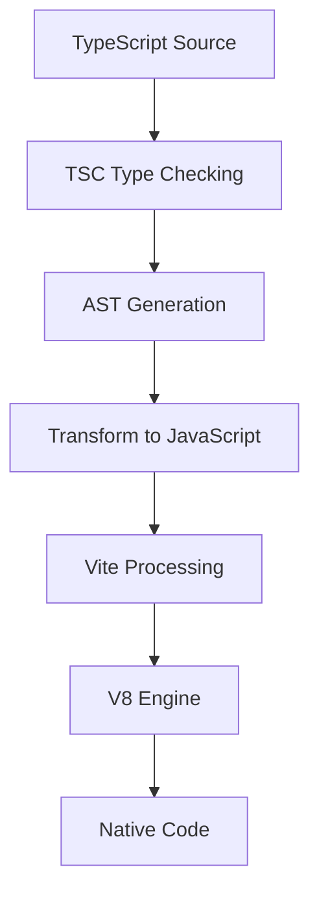
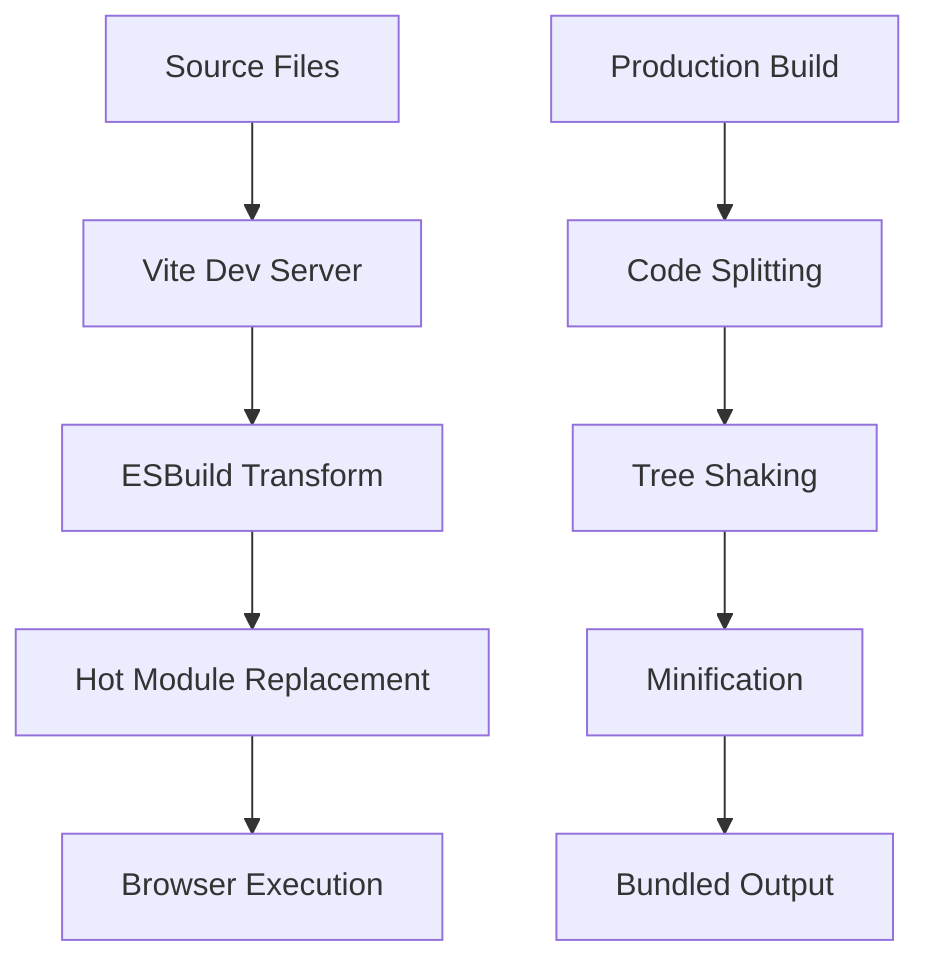

## Overview

TypeScript code undergoes several transformations before execution: type checking, AST generation, compilation to JavaScript, and finally, conversion to native code by the V8 engine. When using Vite as a build tool, this process includes additional optimization steps. This article explores the complete lifecycle and memory management aspects of TypeScript applications.

## Build Process Lifecycle

### 1. TypeScript to JavaScript Pipeline



### 2. Vite Build Process



## Detailed Analysis

### 1. TypeScript Compilation Process

#### Type Checking Phase
```typescript
// Example TypeScript code
interface User {
    id: number;
    name: string;
}

const user: User = {
    id: 1,
    name: "John"
};
```

**AST Generation:**
```json
{
  "kind": "SourceFile",
  "statements": [
    {
      "kind": "InterfaceDeclaration",
      "name": "User",
      "members": [
        {
          "kind": "PropertySignature",
          "name": "id",
          "type": "number"
        },
        {
          "kind": "PropertySignature",
          "name": "name",
          "type": "string"
        }
      ]
    }
  ]
}
```

### 2. Memory Management

#### V8 Memory Structure
```
+------------------------+
|    JavaScript Heap    |
|------------------------|
| New Space (Young Gen) |
| - From Space          |
| - To Space            |
|------------------------|
| Old Space             |
| - Old Pointer Space   |
| - Old Data Space      |
|------------------------|
| Large Object Space    |
|------------------------|
| Code Space            |
|------------------------|
| Map Space             |
+------------------------+
```

#### Memory Allocation Process

1. **Variable Declaration**
```typescript
// Stack allocation
let counter: number = 0;

// Heap allocation
let user: User = {
    id: Math.random(),
    name: "John"
};
```

2. **Memory Layout**
```c
// Internal V8 object representation
struct JSObject {
    HeapObject map;      // Type information
    uint32_t properties; // Named properties
    uint32_t elements;   // Indexed properties
};
```

### 3. Garbage Collection

#### Young Generation (Minor GC)
```javascript
// Objects are initially allocated in young generation
function createObjects() {
    for (let i = 0; i < 1000; i++) {
        let obj = { id: i };  // Allocated in new space
    }
}
```

**Scavenge Algorithm:**
1. Copy live objects from "From" space to "To" space
2. Clear "From" space
3. Swap "From" and "To" spaces

#### Old Generation (Major GC)
```javascript
// Long-lived objects are promoted to old space
class Cache {
    private static instance: Cache;
    private data: Map<string, any>;

    private constructor() {
        this.data = new Map();  // Will be promoted to old space
    }
}
```

**Mark-Sweep-Compact Algorithm:**
1. Marking phase: Identify live objects
2. Sweeping phase: Remove dead objects
3. Compaction: Defragment memory

### 4. Memory Optimization in Vite

#### Development Mode
```typescript
// Vite's HMR handling
if (import.meta.hot) {
    import.meta.hot.accept((newModule) => {
        // HMR logic
    });
}
```

#### Production Build
```javascript
// Vite's code splitting and lazy loading
const UserComponent = defineAsyncComponent(() =>
    import('./components/User.vue')
);
```

### 5. Memory Monitoring

```bash
# Chrome DevTools Memory Profile
$ node --inspect-brk app.js

# Node.js memory usage
$ node --trace-gc app.js
```

### 6. Common Memory Patterns

#### Memory Leaks
```typescript
// Potential memory leak
class EventManager {
    private handlers: Function[] = [];

    addHandler(handler: Function) {
        this.handlers.push(handler);
    }

    // Missing removeHandler method
}
```

#### Proper Cleanup
```typescript
// Memory-efficient cleanup
class EventManager {
    private handlers: Set<Function> = new Set();

    addHandler(handler: Function) {
        this.handlers.add(handler);
    }

    removeHandler(handler: Function) {
        this.handlers.delete(handler);
    }

    dispose() {
        this.handlers.clear();
    }
}
```

## Memory Management Best Practices

1. **Object Lifecycle Management**
```typescript
// Use WeakMap for object-key associations
const cache = new WeakMap<object, string>();

function processObject(obj: object) {
    cache.set(obj, "processed");
    // WeakMap allows obj to be garbage collected
}
```

2. **Resource Cleanup**
```typescript
// Implement disposable pattern
class ResourceManager implements Disposable {
    private resources: Resource[] = [];

    async dispose() {
        await Promise.all(
            this.resources.map(r => r.close())
        );
        this.resources = [];
    }
}
```

3. **Memory-Efficient Data Structures**
```typescript
// Use appropriate data structures
class Cache<K, V> {
    private cache = new Map<K, V>();
    private maxSize: number;

    constructor(maxSize: number) {
        this.maxSize = maxSize;
    }

    set(key: K, value: V) {
        if (this.cache.size >= this.maxSize) {
            const firstKey = this.cache.keys().next().value;
            this.cache.delete(firstKey);
        }
        this.cache.set(key, value);
    }
}
```

## References
- [V8 Memory Management](https://v8.dev/blog/trash-talk)
- [TypeScript Compiler API](https://github.com/microsoft/TypeScript/wiki/Using-the-Compiler-API)
- [Vite Documentation](https://vitejs.dev/guide/)
- [Memory Management MDN](https://developer.mozilla.org/en-US/docs/Web/JavaScript/Memory_Management) 